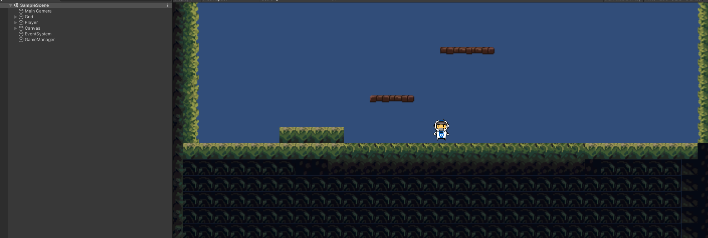
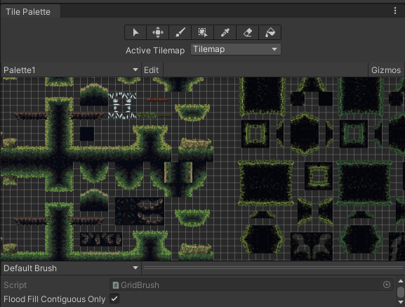
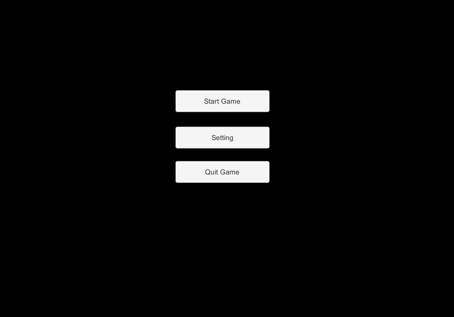
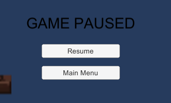
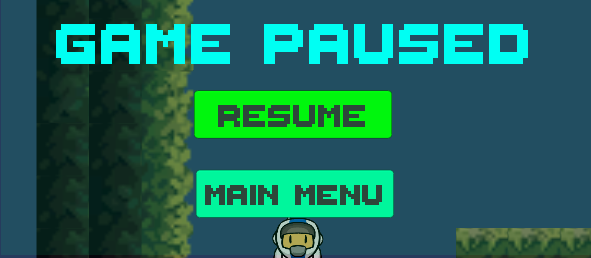

<head>
    
<h1> Alive Squad: Project Progress </h1>
    

</head>

  <a href="./index">Home</a>
  <a href="./explanation">Game Explanation</a>
  <a class="active" href="./Project_Progress">Project Progress</a>
  <a href="./source">Source</a>

 

    
 <h2> Project progress: 03/11/2022 </h2> 

    
<h3> Progression 03/11/2022 </h3>
    
The camera has been implemented and follow the character. Elements and collision boxes needed for levels have been created. The character and his movement animations have been set up. The main menu and the pause menu have also been implemented.

<h3> Camera </h3>
The camera follows the character with the CameraFollow script. For this we tell it at each frame to move towards the Player adding 2/10 of a second of delay for
visual comfort.    

   

    
<h3> Modeling </h3>
Tilesets were imported and then cut into blocks to build the levels. Then a test platform was created to test the character's movements.
character. We then found graphics of astronaut video games on the internet on the internet that we used on the character. Then we managed the
Then we used the sprites to create animations and link them together.

   

     
<h3> Main menu </h3>
Main menu allows to quit the game, access to the settings (for the moment "FullScreen" and "Sound" are the two available settings), and allows you to choose your level by accessing the level menu (level 1 at the moment).

   

    
<h3> Pause menu </h3>
Pause menu has 2 buttons "Resume" and "Main, the first one removes the pause and the game continue; the second one returns to the main menu and leaves the game in
progress. It is also possible to access and exit the pause menu with the Escape key.

   

    
<h3> Forecast for the future </h3>
We will set up the first enemies and the end zones of the game
in order to move on to the next levels. We will make sure that all the levels are finished by the next
submission so that we can focus on multiplayer and the infinite path as well as refinements.

    
 <h2> Project progress: 27/04/2022 </h2> 

<h3> Character life and death bar </h3>
Character life and death bar were added to make the game playlable 

<h3> Combat system: enemies </h3>
First ennemies were added to add difficulty and more gameplay. 

<h3> Multyplayer </h3>
The multiplayer has been added, there are still some bugs but it is functional.

<h3> Scenes </h3>
Scene were linked to make the game functional
    

    
 <h2> Project progress: 06/06/2022 </h2> 

It is our final progress for this project. We are very happy by our result.
<h3> Style </h3>
All the style of our game were updated to match the game vibe. Our menu are now looking good and real menu. For exemple there is our new pause menu:

   

    
<h3> Level </h3>
Levels are now finished ! We made levels to be hard and long. No image because we don't want to spoil you :) You can try directly our game to see what our levels look like. 

<h3> Ennemies and traps </h3>
As explane in the Game Explanation page, Alive Squad has now a lot of ennemies and traps. If you want to learn more about that go look our explanation !
    
<h3> Multiplayer </h3>
Our best feature is now completed and working well ! We added a new item, the respawn tomb. It's now possible to respawn your friend to make the game more fun in multiplayer. We had a lot of problems with synchronization but it's now better. 

<h3> Sound </h3>
One of the most important part of the game were added, the sound ! You can now play the game with his unique music made by our team ! We also added sound for ennemies and player.
    
<h3> Scenes link </h3>
We now have a real scene link for our game, that means you can navigate through menus and levels without any problem. 

